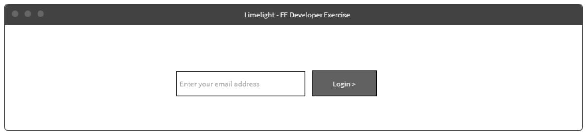
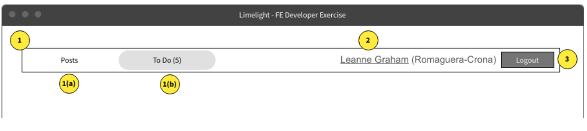
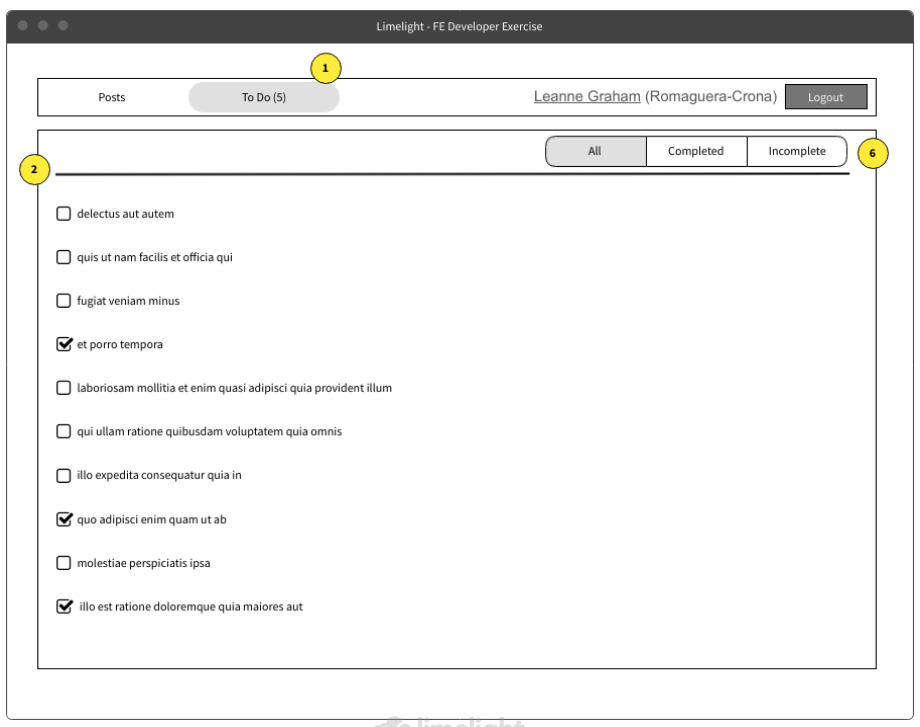

# Task Planner - Front-End Developer Test (Angular)

 

## Running the code
1. `npm install`
2. `ng serve`
3. view at localhost:4200

## Overview
This Front End developer test contains requirements to build a simple web app.

The three main aspects that we will be assessing are: [see Implementation Notes](#implementation-notes)

1. API Management
2. State management & storage
3. UI/UX (styling code management)

You’ll be working against a mock API, provided by: [https://jsonplaceholder.typicode.com](https://jsonplaceholder.typicode.com)

## Requirements

### 1. Login Page

- Use the GET users endpoint [https://jsonplaceholder.typicode.com/users](https://jsonplaceholder.typicode.com/users)
- The "login" is just the user entering the email address
  - User is logged in if the email address is found in the `/users` API
  - Upon failed login (email not found), display an error message
- After successful login, user will be in a "logged in state"
  - Show "To Do" page as the landing page
   
 

### 2. Navigation Bar (after login)

Once a user is logged in, there will be a persistent navigation bar.

- Navigation links to the todo page and the posts page
  - "Posts" link on click should show a pop up saying "This page is not available"
  - The button linking to the todo page should have a number next to it that represents the number of incomplete todos ie TODOs (5)
- Display the user’s name with hyperlink to website (Company’s name), example: Leanne Graham (Romaguera-Crona) 
- A button to log out
  -  On click, the user should be returned to the login screen
      

### 3. To Do Page
  
  1. The “To Do” link on the navigation is highlighted
  2. Display list of To Dos (titles) for the user as checkboxes
      - a. If completed = false - the checkbox should be unchecked and the text
        should be red
      - b. If completed = true - the checkbox should be checked and the text should
        be green
  3. In addition to the data provided by the API, the state should also store a
    “completedDate” field as part of the “To Do” item
      - a. If completed = false - the completedDate should be null
      - b. If completed = true - generate a random or hard coded data in the past
  4. When the user clicks on an already checked box (completed item)
      - a. Modify the state of the to do item to set completed = false and
        completedDate = null
  5. When the user clicks on an unchecked box (non-completed item), modify the
    state of the to do item to set:
      - a. completed = true
      - b. completedDate = {currentDate}
  6. Make the following filters available to the user:
      - a. Show all
      - b. Show completed
      - c. Show completed today - display completed task with date of today
      - d. Show incomplete

## Rules

1. You may not delete any files
2. You may add as many files as you'd like
    > **Note**: You are encouraged to add files to enhance your solution. This repo only provides the basics to allow you to get started.
3. You may not delete any code that already exists.
4. You may edit any file in the `src` directory except the files in the [model](src/app/models/) directory

## Implementation Notes

### API Management

Your data loading must be structured such that you minimize calls to the API. You should only call it if that part of your state has not yet been loaded. A [helper service](src/app/api/api.service.ts) has been preconfigured with all the CRUD functions you might need. You can use these helpers to access the api. Your functions to access the api can either be added to `api.service.ts` or can be added elsewhere.

### State Management & Storage

The main point of emphasis in this exercise is to demonstrate your ability to manage state efficiently. Be very mindful of what data you are selecting, ensuring you’re only taking what you need.

#### NGXS

The documentation for ngxs can be found [here](https://www.ngxs.io/).

Two NGXS states have been preconfigured for you, [user.state](src/app/store/user.state.ts) and [todo.state](src/app/store/todo.state.ts), along with sample action classes in the same directory. You will add selectors and actions to each to manage your state.

#### Models

There are a couple of model files in the [models](src/app/models/) directory. **These files are not to be edited**. Use the structure they provide to inform how you structure your states and selectors

#### User State

[The user state](src/app/store/user.state.ts) holds information about the logged in user.The actions to mutate this state should be added [here](src/app/store/user.action.ts)

#### Todo State

[The todos state](src/app/store/todo.state.ts) holds information about the list of todos. The actions to mutate this state should be added [here](src/app/store/todo.action.ts)

#### Miscellaneous

1. In addition to demonstrating your skills in ngxs, you should do everything you can to show you have a strong command of RXJS.
2. Every aspect of your solution will be considered, so pay attention to your coding style as well as the actual logic of your solution.

## UI/UX

A pretty design is not the main part of this exercise, however it is very important that you have consistent styling throughout. Keep consistent input styling, padding between elements, etc, and be sure to showcase some css knowledge to demonstrate how you would structure the styling part of a UI solution.
